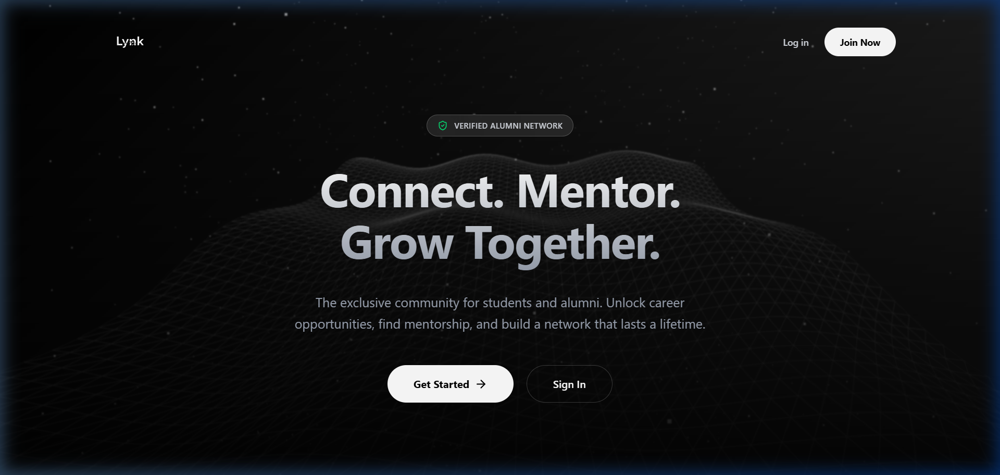

<p align="center">
  
</p>

<!-- <h1 align="center">Lynk</h1> -->

<p align="center">
  <strong>Connect. Mentor. Grow Together.</strong>
</p>

<p align="center">
  The exclusive alumni-student networking platform — bridging the gap between students and alumni through verified connections, real-time mentorship, and AI-powered career tools.
</p>

<p align="center">
  <a href="https://lynk-eta.vercel.app/">🌐 Live Demo</a>&nbsp;&nbsp;•&nbsp;&nbsp;
  <a href="#-features">✨ Features</a>&nbsp;&nbsp;•&nbsp;&nbsp;
  <a href="#%EF%B8%8F-tech-stack">🛠️ Tech Stack</a>&nbsp;&nbsp;•&nbsp;&nbsp;
  <a href="#-getting-started">🚀 Getting Started</a>&nbsp;&nbsp;•&nbsp;&nbsp;
  <a href="#-api-reference">📡 API Reference</a>
</p>

<br/>

<p align="center">
  
</p>

---

> [!IMPORTANT]
> **⏳ Cold Start Notice** — The live demo uses free-tier hosting on **Vercel** (frontend) and **Render** (backend). After 15 minutes of inactivity, the backend server goes to sleep. **When visiting for the first time (or after inactivity), it may take 30–60 seconds for the backend to cold-start.** Please be patient — the app is not broken! Once the server wakes up, everything runs smoothly.

---

## 📑 Table of Contents

- [About The Project](#-about-the-project)
- [Features](#-features)
- [Tech Stack](#%EF%B8%8F-tech-stack)
- [Architecture](#-architecture)
- [Getting Started](#-getting-started)
- [Environment Variables](#-environment-variables)
- [API Reference](#-api-reference)
- [Project Structure](#-project-structure)
- [Deployment](#-deployment)
- [Contributing](#-contributing)
- [License](#-license)
- [Contact](#-contact)

---

## 🎯 About The Project

**Lynk** is a full-stack alumni-student networking platform designed to create a trusted, verified community where college students can connect with alumni for mentorship, career guidance, and job opportunities.

Unlike generic networking platforms, Lynk features:
-  **Admin-verified identities** — Every user is manually verified via college ID upload, ensuring a trusted environment.
-  **AI-powered resume screening** — When students apply for jobs, Google Gemini 2.5 Flash analyzes their resume against the job description and generates a match score + detailed analysis.
-  **Real-time messaging** — Powered by Socket.IO with connection request workflows, unread badges, and email notifications.
-  **Role-based ecosystem** — Separate experiences for Students, Alumni, and Admins, each with tailored dashboards and permissions.

---

## ✨ Features

### 🔐 Authentication & Security
| Feature | Description |
|---|---|
| **JWT Auth** | Access + Refresh token strategy with HTTP-only cookies |
| **Password Hashing** | bcrypt with salt rounds for secure storage |
| **Role-Based Access** | Student, Alumni, and Admin roles with dedicated route guards |
| **Session Persistence** | Auto-restores sessions on page reload |

### ✅ Verification Pipeline
| Feature | Description |
|---|---|
| **College ID Upload** | Users upload verification proof (Cloudinary) |
| **Admin Dashboard** | Admins review, approve, or reject pending verifications |
| **Gated Access** | Unverified users are redirected to a verification waiting page |

### 👤 Rich User Profiles
| Feature | Description |
|---|---|
| **Profile Editor** | Bio, skills, batch year, company, role, and experience timeline |
| **Resume Upload** | PDF upload to Supabase Storage with public URL generation |
| **Avatar & Banner** | Image uploads via Cloudinary with image cropping |
| **Social Links** | LinkedIn, GitHub, LeetCode, and Portfolio links |
| **Privacy Controls** | Toggle mobile number visibility and profile public/private status |
| **Public Profiles** | View other users' profiles with privacy-aware field visibility |

### 💼 Job Board & AI-Powered ATS
| Feature | Description |
|---|---|
| **Post Jobs** | Alumni post jobs with title, description, company, location, type, work mode, salary, and required skills |
| **Job Discovery** | Students browse jobs with search, filters (type, mode, location), and pagination |
| **One-Click Apply** | Students apply with their uploaded resume (snapshot at time of application) |
| **🤖 AI Match Score** | Google Gemini 2.5 Flash reads the resume PDF, compares against job description & required skills, and returns a 0–100 match score with detailed analysis |
| **Application Pipeline** | Alumni manage applicants through stages: Applied → Shortlisted → Interviewing → Hired/Rejected |
| **Smart Sorting** | Applications sorted by AI match score — best candidates shown first |
| **Job Lifecycle** | Jobs support Open / Paused / Closed statuses with auto-expiry (30 days) |
| **Track Applications** | Students can view all their submitted applications and current status |

### 💬 Real-Time Chat
| Feature | Description |
|---|---|
| **Connection Requests** | LinkedIn-style connection workflow with custom messages |
| **Socket.IO Messaging** | Real-time message delivery with instant UI updates |
| **Unread Badges** | Per-conversation unread counters with automatic reset on read |
| **Read Receipts** | Messages marked as read when the conversation is opened |
| **Online Status** | Live tracking of online users via socket handshake |
| **Email Notifications** | Automated emails via Nodemailer on connection requests and acceptances |

### 🛡️ Admin Panel
| Feature | Description |
|---|---|
| **Verification Dashboard** | View all pending verification requests with uploaded proofs |
| **Approve / Reject** | One-click user verification management |

### 🎨 UI/UX
| Feature | Description |
|---|---|
| **3D Landing Page** | Immersive Three.js wireframe terrain with particle effects |
| **Dark Theme** | Sleek, modern dark-mode interface |
| **Responsive Design** | Fully responsive across desktop, tablet, and mobile |
| **Toast Notifications** | Real-time feedback with react-hot-toast |
| **Image Cropping** | Built-in avatar cropping with react-easy-crop |

---

## 🛠️ Tech Stack

### Frontend
| Technology | Purpose |
|---|---|
| [React 19](https://react.dev/) | UI Library |
| [Vite 7](https://vite.dev/) | Build Tool & Dev Server |
| [TailwindCSS 4](https://tailwindcss.com/) | Utility-First CSS Framework |
| [Redux Toolkit](https://redux-toolkit.js.org/) | Global State Management |
| [React Router v7](https://reactrouter.com/) | Client-Side Routing |
| [Socket.IO Client](https://socket.io/) | Real-Time Communication |
| [Axios](https://axios-http.com/) | HTTP Client |
| [Three.js](https://threejs.org/) | 3D Graphics (Landing Page) |
| [Lucide React](https://lucide.dev/) | Icon Library |
| [react-hot-toast](https://react-hot-toast.com/) | Toast Notifications |
| [react-easy-crop](https://www.npmjs.com/package/react-easy-crop) | Image Cropping |

### Backend
| Technology | Purpose |
|---|---|
| [Express 5](https://expressjs.com/) | Web Framework |
| [MongoDB](https://www.mongodb.com/) + [Mongoose 9](https://mongoosejs.com/) | Database & ODM |
| [Socket.IO](https://socket.io/) | WebSocket Server |
| [JWT](https://www.npmjs.com/package/jsonwebtoken) | Authentication Tokens |
| [bcrypt](https://www.npmjs.com/package/bcrypt) | Password Hashing |
| [Cloudinary](https://cloudinary.com/) | Image & Media Storage |
| [Supabase Storage](https://supabase.com/) | Resume (PDF) Storage |
| [Google Gemini 2.5 Flash](https://ai.google.dev/) | AI Resume Analysis (ATS) |
| [pdfjs-dist](https://www.npmjs.com/package/pdfjs-dist) | PDF Text Extraction |
| [Nodemailer](https://nodemailer.com/) | Email Notifications |
| [Multer](https://www.npmjs.com/package/multer) | File Upload Handling |
| [Helmet](https://helmetjs.github.io/) | Security Headers |
| [Morgan](https://www.npmjs.com/package/morgan) | HTTP Request Logging |

---

## 🏗 Architecture

```
┌─────────────────────────────────────────────────────────┐
│                     CLIENT (React)                      │
│   React Router • Redux Toolkit • Socket.IO Client       │
│                  Deployed on Vercel                      │
└────────────────────────┬────────────────────────────────┘
                         │  REST API + WebSocket
                         ▼
┌─────────────────────────────────────────────────────────┐
│                    SERVER (Express)                      │
│  Auth • Profiles • Jobs • Chat • Admin • AI ATS         │
│   JWT + Cookies │ Socket.IO │ Multer │ Helmet           │
│                  Deployed on Render                      │
└──────┬──────────────┬──────────────┬────────────────────┘
       │              │              │
       ▼              ▼              ▼
  ┌─────────┐   ┌──────────┐   ┌──────────────┐
  │ MongoDB │   │Cloudinary│   │   Supabase   │
  │  Atlas  │   │ (Images) │   │  (Resumes)   │
  └─────────┘   └──────────┘   └──────────────┘
                                      │
                               ┌──────┴──────┐
                               │ Google       │
                               │ Gemini AI    │
                               │ (ATS Score)  │
                               └─────────────┘
```

---

## 🚀 Getting Started

### Prerequisites

- **Node.js** v18+ — [Download](https://nodejs.org/)
- **MongoDB Atlas** account — [Sign Up](https://www.mongodb.com/cloud/atlas)
- **Cloudinary** account — [Sign Up](https://cloudinary.com/)
- **Supabase** account — [Sign Up](https://supabase.com/)
- **Google AI Studio** API Key — [Get Key](https://aistudio.google.com/apikey)

### Installation

1. **Clone the repository**
   ```bash
   git clone https://github.com/Bhushan144/lynk.git
   cd lynk
   ```

2. **Install Backend dependencies**
   ```bash
   cd backend
   npm install
   ```

3. **Install Frontend dependencies**
   ```bash
   cd ../frontend
   npm install
   ```

4. **Set up environment variables** (see [Environment Variables](#-environment-variables))

5. **Run the development servers**

   **Backend** (from `/backend`):
   ```bash
   npm run dev
   ```

   **Frontend** (from `/frontend`):
   ```bash
   npm run dev
   ```

6. **Open the app** at `http://localhost:5173`

---

## 🔑 Environment Variables

### Backend (`backend/.env`)

```env
# ── Server ──
PORT=5000
NODE_ENV=development

# ── Database ──
MONGO_URI=your_mongodb_connection_string
DB_NAME=lynk

# ── JWT Secrets ──
ACCESS_TOKEN_SECRET=your_access_token_secret
ACCESS_TOKEN_EXPIRY=1d
REFRESH_TOKEN_SECRET=your_refresh_token_secret
REFRESH_TOKEN_EXPIRY=10d

# ── CORS ──
CORS_ORIGIN=http://localhost:5173

# ── Cloudinary ──
CLOUDINARY_CLOUD_NAME=your_cloud_name
CLOUDINARY_API_KEY=your_api_key
CLOUDINARY_API_SECRET=your_api_secret

# ── Supabase (Resume Storage) ──
SUPABASE_URL=your_supabase_url
SUPABASE_KEY=your_supabase_anon_key
SUPABASE_BUCKET=your_bucket_name

# ── Google Gemini AI ──
GEMINI_API_KEY=your_gemini_api_key

# ── Email (Nodemailer) ──
MAIL_HOST=smtp.gmail.com
MAIL_USER=your_email@gmail.com
MAIL_PASS=your_gmail_app_password

# ── College ──
COLLEGE_NAME=Your College Name
```

### Frontend (`frontend/.env`)

```env
VITE_API_URL=http://localhost:5000/api/v1
```

---

## 📡 API Reference

All endpoints are prefixed with `/api/v1`

### Auth Routes — `/auth`
| Method | Endpoint | Description | Auth |
|---|---|---|---|
| `POST` | `/auth/register` | Register a new user | ❌ |
| `POST` | `/auth/login` | Login with username/email + password | ❌ |
| `POST` | `/auth/logout` | Logout and clear tokens | ✅ |
| `PATCH` | `/auth/avatar` | Upload/update avatar | ✅ |
| `POST` | `/auth/change-password` | Change current password | ✅ |

### Profile Routes — `/profile`
| Method | Endpoint | Description | Auth |
|---|---|---|---|
| `GET` | `/profile/me` | Get current user's profile | ✅ |
| `PATCH` | `/profile/update` | Update profile details | ✅ |
| `GET` | `/profile/all` | Browse alumni directory (search + pagination) | ✅ |
| `GET` | `/profile/:id` | View a public profile | ✅ |
| `PATCH` | `/profile/resume` | Upload resume (PDF) | ✅ |
| `PATCH` | `/profile/banner` | Upload profile banner | ✅ |

### Job Routes — `/jobs`
| Method | Endpoint | Description | Auth |
|---|---|---|---|
| `POST` | `/jobs/post` | Post a new job (Alumni only) | ✅ |
| `GET` | `/jobs/my-jobs` | Get jobs posted by current user | ✅ |
| `GET` | `/jobs/all` | Browse all open jobs (search + filters) | ✅ |
| `POST` | `/jobs/apply/:jobId` | Apply for a job (triggers AI ATS) | ✅ |
| `GET` | `/jobs/applications/:jobId` | Get applicants for a job (Alumni only) | ✅ |
| `GET` | `/jobs/my-applications` | Get current user's applications | ✅ |
| `PATCH` | `/jobs/status/:jobId` | Update job status (Open/Paused/Closed) | ✅ |
| `PATCH` | `/jobs/application-status/:applicationId` | Update application status | ✅ |

### Chat Routes — `/chat`
| Method | Endpoint | Description | Auth |
|---|---|---|---|
| `POST` | `/chat/request` | Send a connection request | ✅ |
| `POST` | `/chat/handle-request` | Accept or reject a request | ✅ |
| `POST` | `/chat/send` | Send a message | ✅ |
| `GET` | `/chat/requests` | Get pending connection requests | ✅ |
| `GET` | `/chat/my-chats` | Get all conversations (with unread counts) | ✅ |
| `GET` | `/chat/messages/:conversationId` | Get messages (marks as read) | ✅ |

### Admin Routes — `/admin`
| Method | Endpoint | Description | Auth |
|---|---|---|---|
| `GET` | `/admin/pending` | Get all pending verifications | ✅ Admin |
| `POST` | `/admin/verify` | Approve or reject a user | ✅ Admin |

---

## 📂 Project Structure

```
lynk/
├── backend/
│   ├── public/                  # Static files
│   ├── src/
│   │   ├── controllers/         # Route handlers
│   │   │   ├── admin.controller.js
│   │   │   ├── auth.controller.js
│   │   │   ├── chat.controller.js
│   │   │   ├── job.controller.js
│   │   │   ├── profile.controller.js
│   │   │   └── user.controller.js
│   │   ├── db/                  # MongoDB connection
│   │   ├── middlewares/         # Auth, Admin, Multer
│   │   ├── models/              # Mongoose schemas
│   │   │   ├── user.model.js
│   │   │   ├── profile.model.js
│   │   │   ├── job.model.js
│   │   │   ├── application.model.js
│   │   │   ├── conversation.model.js
│   │   │   └── message.model.js
│   │   ├── routes/              # Express route definitions
│   │   ├── utils/               # Helpers & services
│   │   │   ├── aiAts.js         # Gemini AI resume analysis
│   │   │   ├── cloudinary.js    # Image upload
│   │   │   ├── supabase.js      # Resume upload
│   │   │   ├── mailSender.js    # Email notifications
│   │   │   ├── ApiError.js      # Custom error class
│   │   │   ├── ApiResponse.js   # Standardized response
│   │   │   └── asyncHandler.js  # Async error wrapper
│   │   ├── app.js               # Express app configuration
│   │   ├── index.js             # Server entry point
│   │   └── socket.js            # Socket.IO server setup
│   └── package.json
│
├── frontend/
│   ├── public/                  # Static assets (logo)
│   ├── src/
│   │   ├── components/          # Reusable UI components
│   │   │   ├── Feed/            # Feed components
│   │   │   ├── Layout/          # App layout wrapper
│   │   │   └── ui/              # Shared UI primitives
│   │   ├── context/             # Socket context provider
│   │   ├── features/            # Redux slices
│   │   ├── pages/               # Route-level page components
│   │   │   ├── About/
│   │   │   ├── Admin/           # Admin verification dashboard
│   │   │   ├── Alumni/          # Job posting & applicant management
│   │   │   ├── Auth/            # Login, Register, Verification
│   │   │   ├── Chat/            # Real-time messaging
│   │   │   ├── Feed/            # Alumni directory feed
│   │   │   ├── Landing/         # 3D landing page
│   │   │   ├── Profile/         # Profile view & edit
│   │   │   ├── Settings/        # User settings
│   │   │   └── Student/         # Job browsing & applications
│   │   ├── store/               # Redux store configuration
│   │   ├── utils/               # Axios instance, helpers
│   │   ├── App.jsx              # Root component & routing
│   │   └── main.jsx             # App entry point
│   ├── index.html
│   ├── vite.config.js
│   ├── vercel.json
│   └── package.json
│
├── .gitignore
└── README.md
```

---

## 🌐 Deployment

| Service | Layer | URL |
|---|---|---|
| **Vercel** | Frontend | [lynk-eta.vercel.app](https://lynk-eta.vercel.app/) |
| **Render** | Backend API | Hosted on Render (Free Tier) |

### Deploying Frontend (Vercel)
1. Push your code to GitHub
2. Import the repository on [Vercel](https://vercel.com/)
3. Set the **Root Directory** to `frontend`
4. Set the **Build Command** to `npm run build`
5. Set the **Output Directory** to `dist`
6. Add the `VITE_API_URL` environment variable pointing to your Render backend URL

### Deploying Backend (Render)
1. Create a new **Web Service** on [Render](https://render.com/)
2. Set the **Root Directory** to `backend`
3. Set the **Build Command** to `npm install`
4. Set the **Start Command** to `npm start`
5. Add all backend environment variables (see [Environment Variables](#-environment-variables))
6. Set `NODE_ENV=production` and update `CORS_ORIGIN` to your Vercel URL

> [!NOTE]
> **Free Tier Limitations** — Both Vercel and Render free tiers spin down services after ~15 minutes of inactivity. The first request after inactivity triggers a cold start (30–60 seconds). This is normal and expected behavior.

---

## 🤝 Contributing

Contributions are welcome! Here's how to get started:

1. **Fork** the repository
2. Create a **feature branch** (`git checkout -b feature/amazing-feature`)
3. **Commit** your changes (`git commit -m 'Add amazing feature'`)
4. **Push** to the branch (`git push origin feature/amazing-feature`)
5. Open a **Pull Request**

---

## 📄 License

Distributed under the **ISC License**. See `LICENSE` for more information.

---

## 📬 Contact

**Bhushan Pagar**

- GitHub: [@Bhushan144](https://github.com/Bhushan144)

---

<p align="center">
  <sub>Built with ❤️ by Bhushan</sub>
</p>
